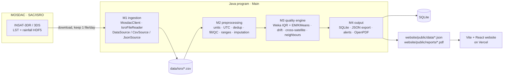

# Architecture

TrustOrbit is one Java program plus a static website. Java does all the work and writes files; the
website only reads them, so there is no server to host.

## Commands → stages

| Command | Stages |
|---|---|
| `download` / `convert` | M1: MOSDAC → `data/isro/*.csv` |
| `run` | M1 read CSV → M2 clean → M3 score → M4 store + export |
| `score <file.csv>` | same as `run` for any CSV |
| `evaluate` | M3 on SYNTHETIC noise/gaps/drift → precision/recall |
| `report` | M4 PDF |

## Design decisions

- **Plain Java instead of Spring Boot / PostGIS / Thymeleaf.** The original proposal listed them; we
  simplified to fit the micro-project scope. SQLite replaces PostgreSQL/PostGIS (spatial work here
  is just nearest-pixel and nearest-station distance, done in Java). PostGIS and a REST API are
  future upgrades.
- **`DataSource` interface.** NASA or other sources can be added later as new implementations.
- **Raw files are transient.** HDF5 files are converted immediately and deleted: they are large and
  MOSDAC does not allow redistributing them.
