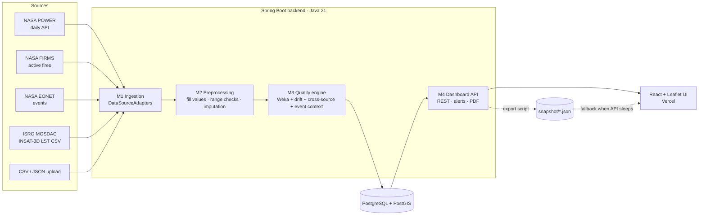

# Architecture

## Deployment

| Piece | Host | Notes |
|---|---|---|
| Front end | Vercel (Netlify config included) | static Vite build; falls back to `snapshot/*.json` |
| API | Render free web service (Docker) – Koyeb as alternative | sleeps when idle |
| Database | Neon or Supabase Postgres with `CREATE EXTENSION postgis` | |
